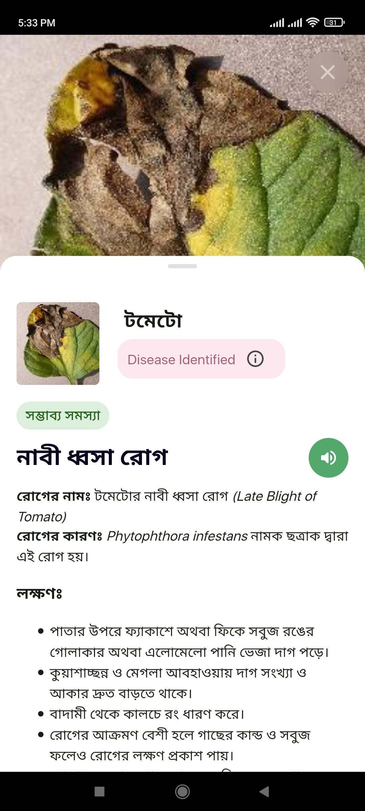

# agro-care-app
# Agro Care App

A plant disease detection, shopping, and community app for farmers, gardeners, and plant enthusiasts.

## Features
- Simple, clean, and easy app interface 👍
- Email-password and Google authentication
- Plant disease detection through leaf scanning (currently supports Tomato, Potato, Corn)
- Assistance via phone call or WhatsApp for farming and gardening support
- Weather updates including temperature and sky status
- Latest trends and news in the agriculture sector
- Fully functional marketplace for seeds, pesticides, irrigation supplies, indoor plants, gardening tools, fertilizers, etc., with cart, ordering, and payment integration via SSL Commerz
- Minimal social features including posting, liking, and commenting
- Profile page with user information display, edit profile functionality, profile picture upload, and view user's orders

## API & Services Used
- `FlutterFire`
    * Ensure to login to Firebase from CLI
    * Use FlutterFire to connect to Firebase (_generates a Dart file - without it the app won't run_)
- Firebase `Auth` for authentication
- Firebase `CloudStore` for database
- Firebase `Storage` for storage service
- `OpenWeather` API for weather information
- `Agro Care Flask` API for plant disease detection: [agro-care-flask](https://github.com/codernayeem/agro-care-flask)
    * Run the Flask app locally or host it
    * Set the prediction API link to the Firebase CloudStore
    * Run the app and scan any leaf
    * _Note: Without starting the server, the detection won't work. Currently, the server is hosted locally, so detection might not work._

## Project Requirements
- `Flutter` v3.16.9 or higher (_The project was developed on `v3.16.9`_)

## Usage

1. **Clone the repository:**
    ```bash
    git clone https://github.com/codernayeem/agro-care-app.git
    ```
2. **Navigate to the project directory:**
    ```bash
    cd agro-care-app
    ```
3. **Install dependencies:**
    ```bash
    flutter pub get
    ```
4. **Configure FlutterFire:**
    ```bash
    flutterfire configure
    ```
5. **Run the app:**
    ```bash
    flutter run
    ```

## Test the app
- Download the latest release from [GitHub Releases](https://github.com/codernayeem/agro-care-app/releases)
- Install the APK on your device (_As the app is not uploaded to the Play Store, you might get a warning. You can safely ingore that._)
- Open the app and explore its features
- Regarding The Disease Detection through leaf scanning
    * The server for detection api is not hosted in remote server yet.
    * Since, the detection server [agro-care-flask](https://github.com/codernayeem/agro-care-flask) can be hosted locally, the local api needs to be set in the cloudstore everytime it changes.
    * Currently, the api saved in cloud store is `http://192.168.0.103:4000/predict`
    * You can run the server locally on that local IP address & port. Then, the detection in app should work fine.
    * Currently, the model is not that robust yet, as the dataset was not that versatile. It is just for testing purpose of the pipeline.

## Screenshots

|  |  |  |
|---------------------------------|---------------------------------|---------------------------------|
|  |  |  |
|  |  |  |
|  |  |  |
|  |  |  |
|  |  |  |
|  |  |  |
|  |  |  |
|  |  |  |
|  |  |  |
|  |  |  |

### Credits
Various images, news information, marketplace details, and disease descriptions used in the app were sourced from the internet for educational purposes only.
